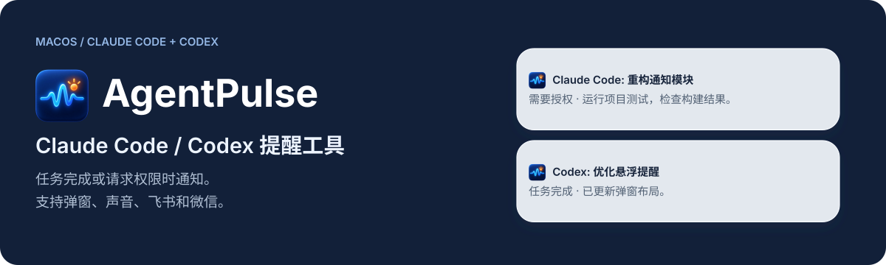
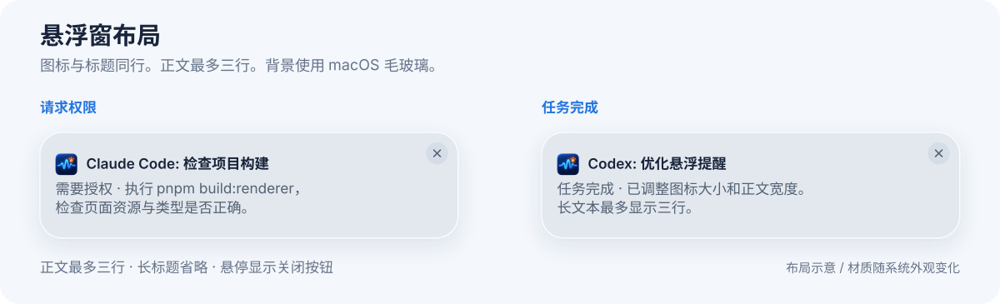
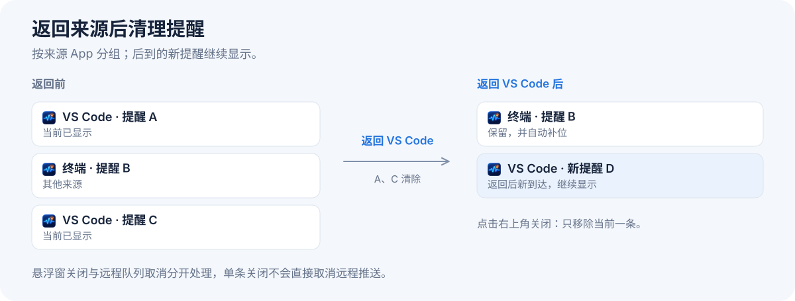
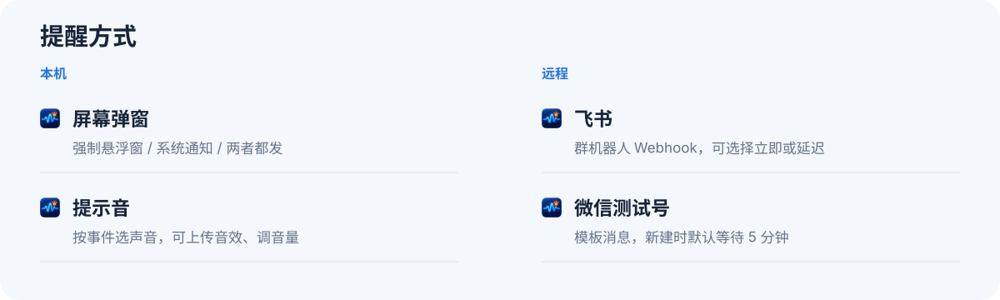
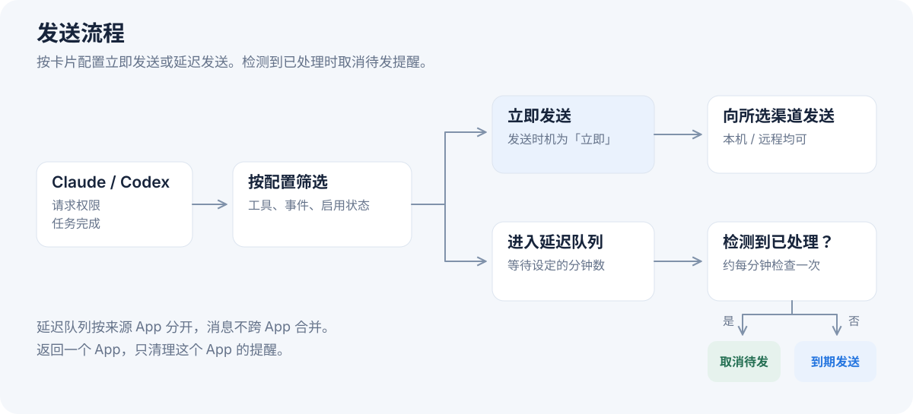
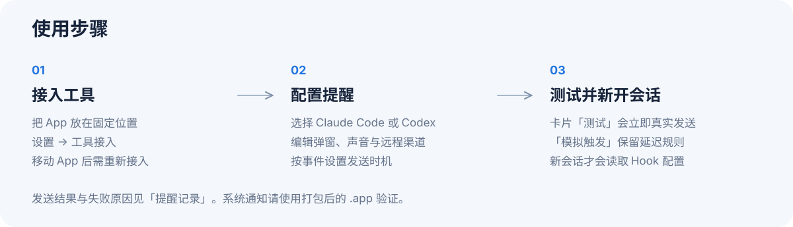

# AgentPulse

<p align="center"></p>

<div align="center">
  <a href="LICENSE"></a>
</div>

AgentPulse 是 Claude Code / Codex 的 macOS 提醒工具。任务完成或请求权限时，通过弹窗、声音、飞书或微信通知你。远程推送可设置延迟。

当前面向 **macOS**，打包最低系统版本为 13.0。Windows / Linux 尚未完成端到端支持。下面的配图是功能与布局示意，实际材质随系统外观变化。

## 弹窗提醒

<p align="center"></p>

悬浮窗使用透明窗口和 macOS 原生毛玻璃材质。窗口在屏幕右上角置顶，不抢焦点。

图标与标题同行，正文最多三行。长标题自动省略。图标依次使用：上传的图片、来源 App 图标、AgentPulse 默认图标。

### 三种屏幕提醒模式

| 模式 | 行为 |
|---|---|
| **强制悬浮窗** | 由 AgentPulse 自己显示窗口，不经过系统通知中心，专注模式下也可显示 |
| **系统通知** | 使用 macOS 通知中心，受系统通知权限和专注模式控制 |
| **两者都发** | 同时显示悬浮窗并发送系统通知 |

点击动作可选「返回来源」或「只关闭」。来源可能是 Claude / Codex App，也可能是运行任务的终端或 IDE。

- **返回来源**：切回对应 App，并清除该来源当时已有的悬浮窗和已送达的系统通知。通过 Dock、Cmd+Tab 或点击窗口手动返回，也会触发这次清理。
- **保留其他提醒**：其他来源的提醒，以及返回后新到达的提醒都会保留。无法识别来源时，不会批量清除。
- **单条关闭**：右上角关闭按钮只移除当前提醒，后面的提醒自动补位。「只关闭」也不执行来源跳转。
- **停留时间**：屏幕悬浮窗和 macOS 系统通知在显示后约 5 秒自动清除，每条独立计时。也可提前关闭或返回来源；后来出现的通知仍有各自的 5 秒显示时间。

系统通知的正文和「返回来源」动作也可切回来源 App；「只关闭」不跳转。macOS 系统通知需要使用打包后的 `.app` 验证。

<p align="center"></p>

## 提醒方式

### 猫咪桌宠

打开顶部的「桌宠」面板，添加带独立编号的桌宠。在「同步消息来源」中勾选 Agent 和来源 App：一只桌宠可以汇聚多个 App、多个 Agent 的消息；也可以为它们分别配置桌宠。勾选「所有来源 App」会同步该 Agent 的全部来源，未勾选任何来源时不接收消息。

| 状态 | 动作 |
|---|---|
| 工作中 | 坐在草垫上的椅子里，在圆桌前操作电脑 |
| 休息中 | 头向后仰，双手搭到椅背后睡觉 |
| 等待权限 | 举起写着「奏」的牌子 |
| 任务完成 | 把一叠稿纸放到桌旁的地面，等你查看 |

动画沿用同一套手绘关键帧，每段补间至 50 帧。卡片中可为四种状态分别指定 PNG 文件夹、帧间隔和进入／循环／退出片段。默认进入 1–5 帧、循环 6–45 帧、退出 46–50 帧；任务完成默认停在循环末帧等待。状态变化先播完当前循环，再播放退出和下一状态的进入片段。

文件夹使用从 `0001.png` 开始连续编号的 PNG。输入绝对路径后点击「检查文件夹」读取帧数；留空使用内置素材。四个状态的进入首帧和退出末帧须相同。目录和格式见 [桌宠素材说明](assets/pet/README.md)。

点击猫咪，返回**第一条待处理消息的来源 App**。清理该 App 当时已有的桌宠提醒，其他 App 和随后到达的新消息继续保留。没有可识别来源时不跳转。按住猫咪中央即可拖动，右键菜单可返回来源或关闭当前桌宠；空闲时只保留动画和编号，不显示「休息中」气泡。

工作状态来自实际 Hook：发出新任务、开始使用工具、工具执行完、请求权限或任务结束。已有用户需要在「工具接入」中重新接入并新开会话，才能收到新增的开始执行事件。界面只显示最近收到的活动，不推测任务进度；工具异常退出而未发送结束事件时，状态可能停留在工作中。

Codex 的权限提示会等待 2 秒再显示为「权限处理中」，显示 5 秒后收起；期间对应工具已执行完或任务已结束，就提前清除。后续执行结果会清除对应请求，任务结束也会清理该会话的旧权限提示。内部自动批准和人工批准共用这套状态更新；收起提示不表示已经批准，没有后续活动时只保留桌宠动画，不继续举牌或宣称正在工作。

桌宠只接收开启后到达的消息。停用或关闭只清空这只桌宠的队列；取消同步来源，只清理该桌宠来自相应来源的消息。退出 App 清空临时队列，原有提醒记录和远程队列不受影响。

运行开发服务后，可打开 `http://localhost:3000/pet.html?demo` 查看四种动画和多来源点击演示。演示页使用模拟数据，不跳转真实 App。

### 配置卡片

<p align="center"></p>

| 提醒方式 | 配置与用途 |
|---|---|
| **屏幕弹窗** | 上面的三种模式；每个工具最多一张配置卡片 |
| **提示音** | 请求权限、任务完成可分别选声音；支持上传音效和调整音量 |
| **飞书** | 群机器人 Webhook；开启签名校验时填写签名密钥 |
| **微信测试号** | 填写 appID、appsecret、openid 和模板 ID；模板需要包含 `{{title.DATA}}`、`{{body.DATA}}`、`{{time.DATA}}` |

Claude Code 与 Codex 的提醒方式分别配置，也可以把一张卡片复制到另一个工具。每张卡片独立选择接收「请求权限」「任务完成」或两者。

飞书使用 Webhook 地址；目前没有独立的通用 HTTP Webhook 渠道。

## 延迟推送

<p align="center"></p>

每张提醒卡片单独设置发送时机。飞书和微信可立即发送，也可延迟 1、3、5、10、15、30 分钟。新建飞书默认立即发送，微信测试号默认延迟 5 分钟。

例如，保留本机弹窗和声音，把微信设为延迟 5 分钟：

1. 事件到来后，本机先提醒，微信进入等待队列。
2. 等待期间，如果检测到你切回来源 App 或在其中操作，就清空该 App 的待发提醒。同一 App 内发出新消息、批准对应权限或同一会话继续产生 Hook 事件，也会取消该 App 内对应工具的待发提醒。
3. 到期仍未检测到处理行为，才发送远程消息；可选择合并多条提醒或逐条发送。

延迟队列按来源 App 分开：Terminal、VS Code、Claude / Codex 桌面 App 各自排队。聚焦 VS Code 只清空 VS Code 的队列，Terminal 和其他 App 的提醒保留。同一 App 内仍使用 Claude Code / Codex 各自的提醒配置，消息不跨 App 合并。

悬浮窗也按来源 App 清理。无法识别来源 App 的提醒，不根据其他 App 的焦点或活动自动清空。

队列约每分钟检查一次，取消结果可能稍后反映到面板。停用或删除提醒方式后，队列不再向它发送；延迟发送失败最多尝试三次。**关闭一条悬浮窗本身不代表任务已处理，也不会直接取消远程队列。**

## 使用步骤

<p align="center"></p>

已有本机构建的 App 时：

1. 将 `AgentPulse.app` 放到固定位置（例如 `/Applications`）并打开。
2. 在「设置 → 工具接入」中接入 Claude Code 或 Codex。接入会写入当前 App 内 Hook 程序的路径，因此移动 App 后需要重新接入。**Codex 还需信任 Hook**：接入时会展示 AgentPulse 的命令和事件，请确认「信任」。已有接入可点击「重新接入」完成信任；取消后保留配置，未信任的 Hook 暂不能发送提醒，也可在 Codex CLI 输入 `/hooks` 手动信任 AgentPulse 条目。
3. 返回首页，选择工具，编辑屏幕弹窗与提示音；需要远程提醒时，再添加飞书或微信测试号。
4. 点击卡片上的「测试」或编辑页的测试按钮。**测试会真实发送，并忽略延迟设置**。
5. **新开一个 Claude Code / Codex 会话**，让工具重新读取 Hook 配置，并用真实任务检查提醒。「已配置」及事件勾选仅表示 Hook 已写入，不代表已验证真实消息接收。

「设置 → 通用 → 模拟触发」也会真实发送。它使用当前工具的已保存配置，保留延迟规则。

发送结果、失败原因和延迟状态见「提醒记录」。

### 退出界面与卸载提醒

- 退出 App 后，已接入的工具仍会发送提醒。收到消息时只启动后台通知进程，不打开主界面、Dock 图标或桌宠；主动打开 AgentPulse 后才恢复主界面和已启用的桌宠。
- 「设置 → 通用 → 卸载提醒」会备份并移除 Claude Code / Codex 中 AgentPulse 的 Hook，保留其他 Hook 和已保存的提醒配置。已有会话需重启后生效；已进入延迟队列的消息不受此操作影响。

关闭主面板后，App 仍可在后台接收提醒；通过菜单栏图标重新打开面板或退出。开机自启可在「设置 → 通用」中开启。

## 从源码构建

### 准备环境

需要 macOS、Xcode Command Line Tools、Node.js 22、pnpm 10，以及 PATH 中可用的 `rustup`。命令均在仓库根目录执行。

`scripts/env.sh` 会把 Rust 环境指向仓库内的 `.toolchain/`，它不会下载工具链。首次克隆需要初始化这个环境：

```bash
pnpm install --frozen-lockfile
source scripts/env.sh
rustup toolchain install stable --profile minimal
rustup default stable
```

### 构建本机 App

```bash
scripts/build-app.sh --bundles app --config '{"bundle":{"createUpdaterArtifacts":false}}'
open src-tauri/target/release/bundle/macos/AgentPulse.app
```

脚本先编译并放置 `agentpulse-hook`，再打包 App。本机构建关闭自动更新产物生成，不需要更新签名密钥；本地 App 使用 ad-hoc 签名，未做 Apple 公证。

如需同时生成 DMG：

```bash
scripts/build-app.sh --bundles app,dmg --config '{"bundle":{"createUpdaterArtifacts":false}}'
```

构建产物位于 `src-tauri/target/release/bundle/`。

### 开发与检查

首次先完成上面的 App 构建，生成开发环境也需要的 Hook 文件；之后可运行：

```bash
source scripts/env.sh
pnpm dev
```

Vite 提供前端热更新，Rust 修改会触发重编译。开发模式可以检查悬浮窗；系统通知请使用打包后的 `.app`。

```bash
source scripts/env.sh
pnpm build:renderer
cargo test --locked --manifest-path src-tauri/Cargo.toml
```

测试使用临时目录和替身，不发送真实通知。部分通信测试需要允许创建本地 Unix socket；受限沙箱可能阻止这些测试运行。

## 数据与实现

Tauri 2 + React / Vite / Tailwind，提醒核心使用 Rust，macOS 窗口与系统通知通过 AppKit 桥接。运行 App 不需要 Python 或 Swift 环境。

```text
src/                         React 面板与悬浮窗页面
src-tauri/src/
  core/                      配置、事件、渠道、延迟队列、活动判定
  bin/hook.rs                Claude / Codex 的 Hook 入口
  commands.rs                面板命令，测试与模拟发送在后台执行
  ipc.rs                     Hook → App 的本地 Unix socket
  overlay.rs / overlay/      悬浮窗、来源清理与 macOS 面板
  pet.rs                    桌宠窗口与按来源处理的临时消息队列
  notifications/             macOS 系统通知与点击响应
scripts/env.sh               仓库内 Rust 环境
scripts/build-app.sh         Hook 与 App 构建入口
```

- 数据默认保存在 `~/.agentpulse/`；配置密钥位于 `config.json`（权限 0600），前端读取脱敏值。`AGENTPULSE_HOME` 可覆盖数据目录。
- 修改 Claude / Codex 的 Hook 配置前先备份，只改 AgentPulse 条目；JSON 解析失败时中止。
- Hook 事件处理与队列 worker 保持 stdout 静默，程序始终 `exit 0`；仅安装、卸载子命令打印接入结果。批准权限仍在来源工具中完成。
- App 日志位于 `logs/app.log`，Hook 异常位于 `hook-errors.log`，提醒记录位于 `events.jsonl`。
- `.toolchain/`、`.venv/`、`node_modules/`、构建产物及 `.codegraph/` 等本地索引不进入 Git。

自动更新界面和发布工作流已接入，但当前更新地址仍含 `OWNER/agentpulse` 占位值。发布可用更新前，需要配置真实仓库地址和更新签名密钥；目前请通过本机构建更新 App。

贡献与代码约定见 [PROJECT.md](PROJECT.md)。

## 许可证

[MIT](LICENSE)。
